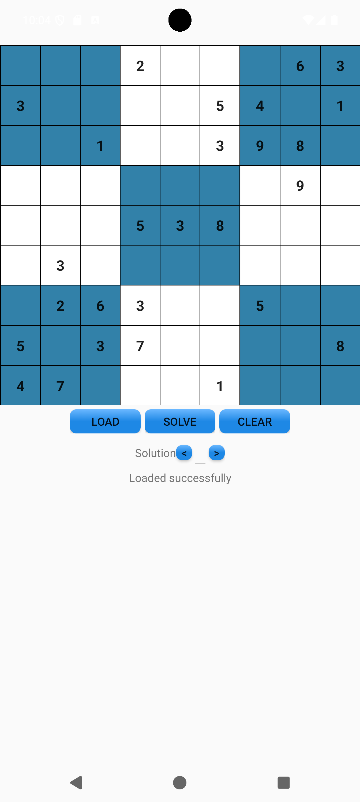
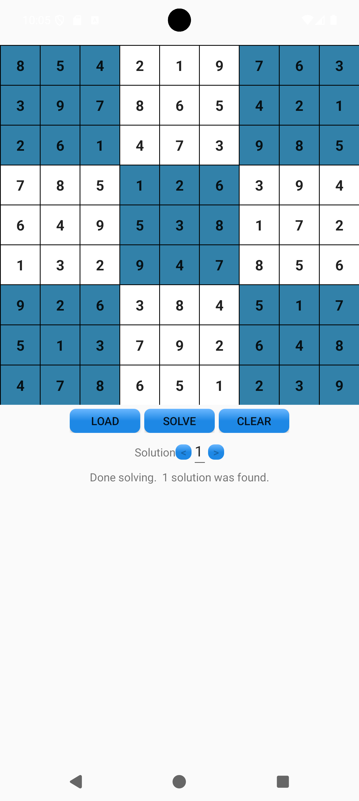
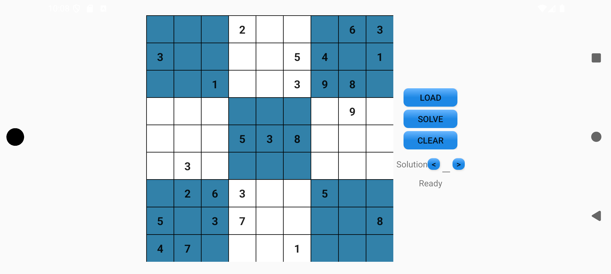
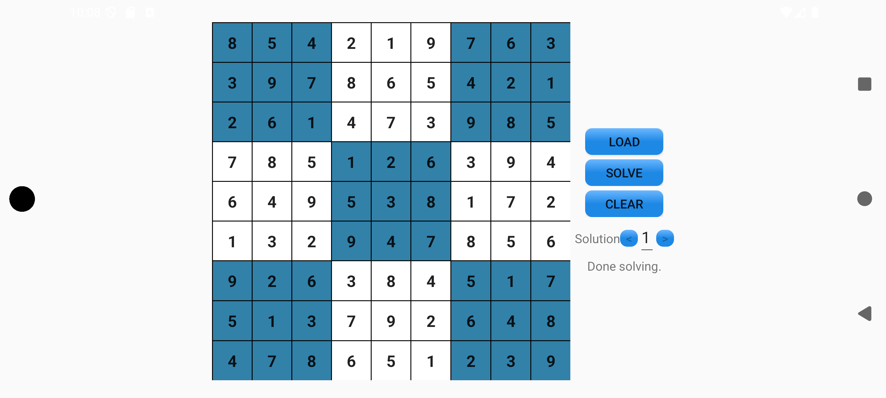

# Android Sudoku solver
This is a Sudoku puzzle solver for Android.  I originally created this in November-December
2019; I started working on this app again in January 2026; I've updated the build settings
to be more recent; i.e., it can build for and run on a Google Pixel 8 Pro, for instance.
While working on the new updates, I also used the latest version of Android Studio and
started using its integrated Google Gemini AI support.  The AI helped update the project
and its settings to build with the more recent Android Studio and related tools, which
saved significant time I probably would have spent if I had done those updates manually.
Also, the AI helped in making some updates to the UI.

In this app, there's a Sudoku board that you can type numbers into directly; you can also
load puzzles from text files.  The text file format is simple: Each line of the text file
corresponds to the line from the puzzle board, with dots representing empty cells.  The
first line can also be a comment starting with the # character.  You can copy puzzle files
onto your Android device and then load them from this app.  There is a set of pre-defined
puzzle files in the puzzles directory.

To solve Sudoku puzzles, I used a brute-force algorithm that was published online. I don't
quite remember where I saw it, but it looks like there are similar algorithms
<a href='https://codereview.stackexchange.com/questions/46640/logical-sudoku-solver-in-java' target='_blank'>here</a>.

In the 'puzzles' directory, the 'nearWorstCase.txt' puzzle is challenging for the algorithm.

One feature I'd like to implement in the future is the ability to use the rear camera to
scan a Sudoku puzzle and use OCR to read the numbers and populate the Sudoku grid in the
app.

I haven't submitted this to the Google Play store, as there are already other Sudoku solver
apps there, and I didn't want to add yet another one.  I mainly wanted to create a Sudoku
solver app myself, which doesn't have any ads, etc..

I used Android Studio to make this application and used Kotlin as the programming language.
Currently, it is set up for the following:
<ul>
<li><b>Compile SDK version</b>: 36
<li><b>Minimum SDK version: </b>: 23
<li><b>Target SDK version</b>: 36
</ul>

# Screenshots
The following are screenshots of the app, with a puzzle typed in and after the puzzle is solved:

  
  
  
  

